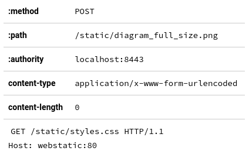
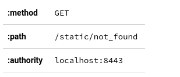
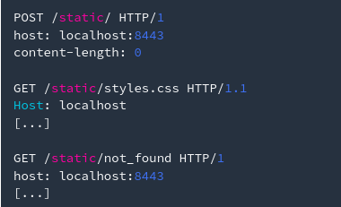
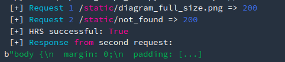

# HTTP2 CL

Lab where a newline can be injected into the `Content-Length` HTTP2 header.

### Running the lab

To run the lab, you need docker and docker-compose (now built in with docker).

```
> docker-compose up
```

The following requests will test if the proxy transforms HTTP 2 to HTTP 1.1 without validation to unnecessary header such as the `content-length`

Request-1 <br />


Request-2 <br />


The proxy supporting will sees two requests therefore will return two responses. If the second response is a 404, this means that the second request was /static/not_found.

However, if the second response returns a 200 OK with stylesheet (style.css), this means that the proxy generated an HTTP1 stream similar to the following.



Because, the content-length header is injected in the first request. The stream generated what would be seen by most web server as three request.

Using the exploit script to detect the vulnerability.
```
> python exploit_http2_hrs.py --host https://localhost:8443 --url1 /static/diagram_full_size.png --url1s /static/style.css --url2 /static/flag.txt
```



Log <br />
